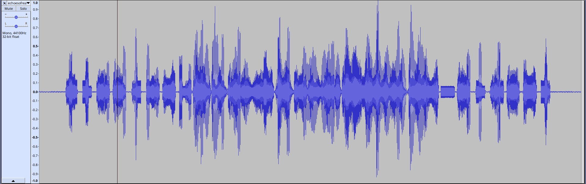
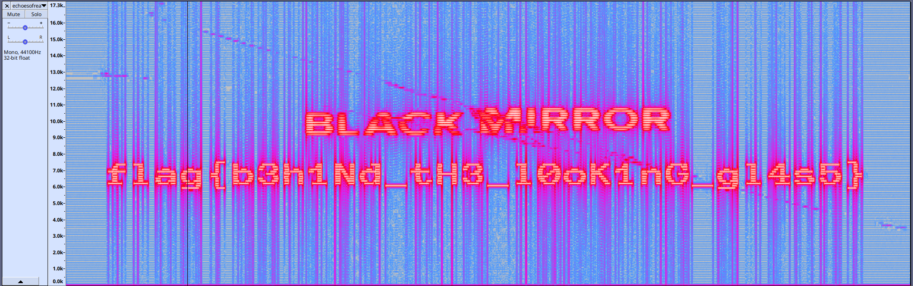

## Solution for: Echoes of Reality

### Concept

This challenge demonstrates a method of hiding images in audio files by encoding an image into audio that is viewable by graphing the audio's spectrogram

### Solve

We are given an audio file - listening to it doesn't reveal anything except a bunch of irregular high pitched beeps and squeaks. It doesn't sound like it has any kind of pattern, so it's not something like morse.

What next, then? Let's pop it open and take a look at it - I used Audacity, there is a number of other audio viewing/editing software you could use here, including web apps. Looking at the normal waveform graph doesn't reveal anything interesting...

Audacity has another way to view audio files other than the waveform graph - the spectrogram, which is a visual representation of the frequency of the audio signal over time. To access it in Audacity, click the track name at the top left of the graph's side panel, and select 'spectrogram'

Bingo - `flag{b3h1Nd_tH3_l0oK1nG_gl4s5}`

