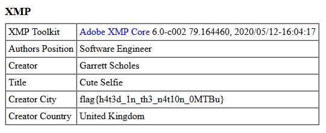

## IMG Metadata
The challenge description hints that some kind of information can be extracted from the attached image.

Taking a look at the image's metadata using exiftool or just a simple online metadata viewer (for example: http://exif.regex.info/exif.cgi), we can see that the flag is included as a part of the Creator City field in the exif data.

The flag is flag{h4t3d_1n_th3_n4t10n_0MTBu} 
