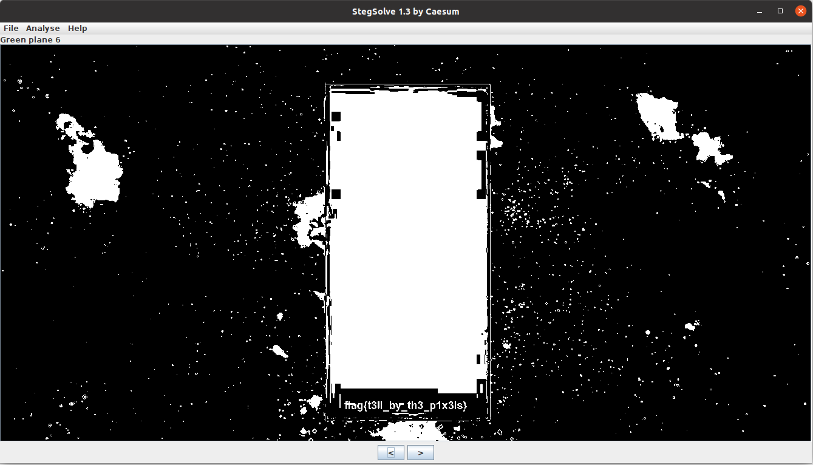

## Steganography Challenge
The challenge description hints that a message is "hidden" in the provided image. The flag text is written at the bottom of the Zima Blue rectangle in a shade of blue just slightly different from the rectangle.
Opening the image up in stegsolve, you can make this text visible by clicking through the filters.

flag{t3ll_by_th3_p1x3ls}
