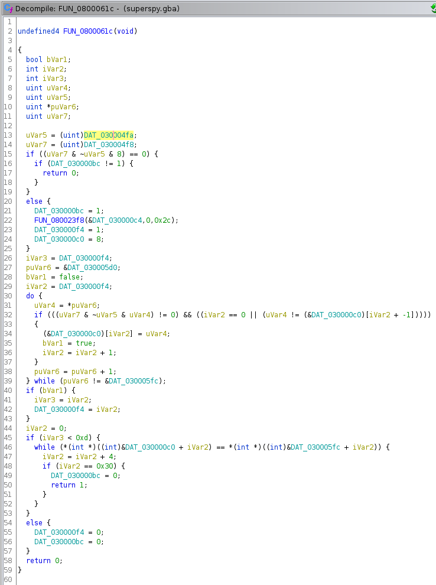

## Solution for: Mega Race

### Concept

This challenge is a GBA game. With this, we're testing reading pure assembly (although if you're crafty you might be able to get decompilation!) of a monolithic ROM. 

Many times in real RE you'll find yourself reversing an embedded binary for a system you don't know the spec of. The GBA has a significant amount of hardware support for much of its functionality, much of which is implemented by just writing a value to a particular memory location or register.

### Solve

NOTE: Some of the screenshots may have slightly different addresses from the debugger. There was an edit to the challenge I made halfway through writing the solution writeup so if they're a little different don't worry.

Once again we're stepping it up. This is about as hard as an "intoductory" CTF challenge can be. When we run the ROM, we're greeted with a message and a countdown. After the countdown expires we're dropped into a game. We can move left and right, and we can jump around the platforms. There is a coin in the top right, which is really the only objective here, but we can't quite reach that platform with the height we can jump.

As the hint in the description says, we need to cheat, and GBA cheats came in the form of glorious cheat codes. Luckily for us, we're reverse engineers, so finding a cheat code should be a piece of cake.

The simplest way to get disassembly for a GBA ROM is using the pip package [luvdis](https://pypi.org/project/Luvdis/), but I'll be using Ghidra because it makes it a bit easier to identify what parts of the ROM are. Without reading what is essentially a textbook at [tonc's site](https://www.coranac.com/tonc/text/), it'll be tricky for beginners to recognize parts of the ROM as code, sprite data, etc.

To set up ghidra for this all you need to do is install [this extension](https://github.com/SiD3W4y/GhidraGBA) (the first result on google for "Gidra GBA") following the instructions in the README. Then, open Ghidra and make or open a project. Doesn't matter what you call it. 

From there, go to `File->Import File` and select `super-spy.gba`. With the GhidraGBA plugin installed, select "Yes" or "Ok" for all the prompts and leave analysis settings at the defaults.


Now that we have our ROM loaded, we need to figure out where to start. Ghidra will automatically label an `_entry` function:


But that isn't a great place to start because it is inserted automatically by the GBA toolchain. We want to find a user-defined function. There are several strings when the game loads, so if we can find references to those strings, we will know where we're at.

This is a great way to quickly profile a binary without delving too deeply into the nitty-gritty of assembly, just look at the strings of the program and find the function that uses them. This will allow you to correlate a block of code to a runtime event.

So, lets look for strings we know. Go to `Window->Defined Strings` in Ghidra to get the below listing:


To find references to a string, right click the string's variable name in Ghidra and select `References->Show References To Address`. This will bring up a table with two entries. Select the one that isn't just the address and it will take you to a function with undefined name. We'll call this function `intro` by clicking the function name and pressing the `L` key, then entering the new name. 

We can find the caller of this function by right clicking on `intro` and once again selecting `References->Show References To Address` and selecting the entry that calls `intro`.


This will take us to a function called `Undefined__SOMETHING`. This means that Ghidra has not recognized this as a function. So highlight the line in the disassembly view that is labelled with a greyed out label and press the `F` key to create a function here. Now we'll be able to use it as a function instead of unrecognized bytes. We'll have to do this a few times because Ghidra isn't perfect at detecting functions in the GBA ROM (understandable, since the format is loosely defined; the processor is an ARM processor but has hardware-specific features that are not standard. You could go up further until you get to `_entry` eventually, but we'll stop here because I wrote this challenge and I know this is main, and we have a lot more work to do without going on wild goose chases up the call stack. 

Now that we've found main we can see the sequence of events.


`main` calls `intro`, which prints out the welcome message and the timer, then calls a second function. This second function is almost certainly the game loop, because we have an infinite loop. We have a break in the infinite loop that calls a function that prints mission success, so this game loop repeats until we win.


You have two choices here. First, you can try and reverse the function that prints out the flag. Second, you can try and figure out how to cheat and get that darn coin! I don't care how you solved this (they're pretty close to the same difficulty), but I'll only cover the cheat code method because hey, it's a game. That's way cooler.

Now, a lot of this RE hinges on knowing the composition of a particular structure. Luckily, any RE person who ran `strings` on the ROM will have this structure definition handy because I gave it as a gift to make this not take forever.

```c
typedef struct player{
    int height;
    int width;
    int x;
    int y;
    int move_speed;
    int gravity_timer;
    int last_dir;
    int jump_per_px;
    void (*move)(struct player *);
    OBJ_ATTR * sprite;
} player;
```

Looking at the game loop above, we see four function calls followed by an initialization that *just so happens* to be the same number of items as the struct above. If we use Ghidra to define a structure (actually, two structures, more on that later), we can make the rest of this MUCH easier.

To define a new structure in Ghidra, right click the `super-spy.gba` dropdown in the Data Type Manager window:


And click `New->Structure`. This will open up the Structure Editor window. Define the above struct like so:


Note that the `player` struct (I called it that in the code and I like to keep things consistent) has a member of type `OBJ_ATTR *`. A little research on GBA programming with those keywords will lead you to [this site](https://www.coranac.com/tonc/text/regobj.htm) mentioned before. This struct definition isn't *from* tonc, but from nintendo. In fact, the hardware implements this struct for the hardware definition of sprites for the Gameboy Advance hardware. Anyway, the struct is:

```c
typedef struct tagOBJ_ATTR
{
    u16 attr0;
    u16 attr1;
    u16 attr2;
    s16 fill;
} ALIGN4 OBJ_ATTR;
```

So just define that before defining the `player` struct and you'll be able to type it in no problem. Then, right click on the code `local_40 = 0x10` (this is the first element of the struct and select `Retype Variable`. Type in `player` to the dialogue box to retype this variable as the `player` structure instead of a bunch of local integers. Once that's done, your code will look *much* better in Ghidra.


 Now if we look for some way to make our jump height higher, we notice the code:

 ```c
iVar1 = FUN_080005ec();
if (iVar1 != 0) {
  local_40.jump_per_px = 6;
}
```

This increases our `jump_per_px` value from 2 to 6. If that ain't enough to get the coin I don't know what is. So lets look at the function that we need to return true.



Uh...oof. But actually it isn't as bad as it looks. 


Now, we need to understand how key polling works in GBA code. The GBA uses a register for key inputs. That register is set up as follows:

| F | E | D | C | B | A | 9 | 8 | 7 | 6 | 5 | 4 | 3 | 2 | 1 | 0 |
| --- | --- | --- | --- | --- | --- | --- | --- | --- | --- | --- | --- | --- | --- | --- | --- |
| - | - | - | - | - | - | L	| R	| down	| up	| left	| right	| start	| select	| B	| A |

Where the key register is `REG_KEYINPUT`. The key cycle libtonc uses:

```c
__key_prev= __key_curr;
__key_curr= ~REG_KEYINPUT & KEY_MASK;
```

Where `REG_KEYINPUT` is `(0x04000000+0x0130)`. Anyway, the important thing is we know we're getting the reg value from somewhere. 

Now, it's reasonably obvious looking at the code of this function that we're going through the possible keyvalues (helpfully provided!) and appending to an array if that key is pressed. Lets go through that step by step. 

First, we get our prev and current key values:

```c
key_prev = (uint)DAT_030004fa;
key_curr = (uint)DAT_030004f8;
```

These data addresses will be loaded at the start of the ROM as they are values in libtonc. These will be used in the `key_hit` function to determine if a key has been pressed. The code for `key_hit` can be found [here](https://github.com/devkitPro/libtonc/blob/master/src/tonc_input.c) and is relevant to the functionality of the game but not particularly so to the solution. In essence, we're checking whether a particular bit of the `REG_KEYINPUT` register is set to 1 _and_ was not set to 1 prior. In other words, the button was not pressed before and is now pressed (ie it is not held down). 

```c
if ((key_curr & ~key_prev & 8) == 0) {
    if (cheat_mode != 1) {
      return 0;
    }
} else {
    cheat_mode = 1;
    memcpy(&cheat_input,0,0x2c);
    DAT_030000f4 = 1;
    cheat_input = 8;
}
```

Next, we check if `KEY_START` has been pressed and if not, whether we are in `cheat_mode` (if you look at `main`, you'll see that the character only moves in response to keypresses if this value is 0). If we aren't, we just return 0. Otherwise, we set `cheat_mode` true , zero out the cheat input array, and proceed. Setting the variable we're calling `cheat_mode` to true, remember, disables movement so that key entry will only be used for the cheatcode until it is full. Now, ghidra won't tell us properly what is in the data of the array of keys (so we can check the sequence) or the number we're iterating up to (`&keys_sz`) in decompilation below:

```c
do {
    key_to_check = *KEYS;
                    /* key_hit */
    if (((key_curr & ~key_prev & key_to_check) != 0) &&
       ((cheat_entry_idx == 0 || (key_to_check != (&cheat_input)[cheat_entry_idx + -1])))) {
          (&cheat_input)[cheat_entry_idx] = key_to_check;
          bVar1 = true;
          cheat_entry_idx = cheat_entry_idx + 1;
    }
    KEYS = KEYS + 1;
} while (KEYS != &keys_sz)
```

There's a fair bit happening up there. We check if a key has been pressed (the value in that bit of the `REG_KEYINPUT` register is set to 1), and that our index into the cheat entry array is either 0 or the current entered key is not the same as the last entered key. If those are satisfied, we add the currently pressed key to the array and iterate our index in the cheat entry array up.

As I mentioned before, we're missing some information here if we just use Ghidra. There's two good options. First is to use a debugging emulator, this is the technique I'll use here because it's important to get familiar with debuggers on odd platforms and the (sometimes extremely arcane) methods you'll need to use to set them up. Second option is to use the `luvdis` disassembly (which is also provided in this solution) to just....figure it out. Gross!

On to debugger land! We want to breakpoint execution at this function and print out the memory it references to check the cheat code. I'll be using `vba-sdl-h` from [here](http://www.romhacking.net/download/utilities/297/). On my system, te command to start the debugger with the BIOS and ROM is:

`$ wine ./VisualBoyAdvance-SDL-H.exe -b ~/Downloads/gba_bios.bin -d /home/novafacing/hub/bootcamp-2020/rev/02-super-spy/src/docker/devkitpro/super-spy/super-spy.gba`

We have a debugger console and a window for the game. Running `h` or `?` in the console will print out all the available instructions. We're just going to hit `c`, for continue. This will let the game run normally. Note that it is *critical* that you let the game start before trying to debug, as the GBA copies the ROM into system memory in the correct locations to run the game after starting up! If you disassemble the below addresses without starting the game you'll see total junk.


Once we have loaded into the game past the Gameboy screen and countdown timer, move around a bit and press F11. F11 will break out of execution and give us our debugger console back.

Now, we could single step until we get to the `process_cheatcode` function call by hitting `n` repeatedly. We're going to be a little smarter. Use `rt 080005ec` to instruct the debugger to run until the `process_cheatcode` function, then jut mash buttons until it halts. You'll notice that the `START` button will get us paused at this address pretty quickly. Anyhow, we're now in the function, we can dump the assembly using `d`. This isn't the whole function, keep in mind, but it is the first part. We want to get the values at the PTR in the instruction `0800061e 23 4f ldr r7,[PTR_DAT_080006ac] = 030005d0`. Our disassembly of the top of the function is:

```asm
080005ec  b5f0 push {r4-r7,lr}
080005ee  46c6 mov lr, r8
080005f0  2608 mov r6, #0x8
080005f2  4b2b ldr r3, [$080006a0] (=$030004fa)
080005f4  4a2b ldr r2, [$080006a4] (=$030004f8)
080005f6  881b ldrh r3, [r3, #0x0]
080005f8  8814 ldrh r4, [r2, #0x0]
080005fa  439c bic r4, r3
080005fc  b500 push {lr}
080005fe  4d2a ldr r5, [$080006a8] (=$030000a0)
08000600  4226 tst r6, r4
08000602  d03b beq $0800067c
08000604  0028 lsl r0, r5, #0x00
08000606  2701 mov r7, #0x1
08000608  222c mov r2, #0x2c
0800060a  2100 mov r1, #0x0
0800060c  3024 add r0, #0x24
0800060e  61ef str r7, [r5, #0x1c]
08000610  f001 bl $080023f8
debugger> d 08000610
08000610  f001 bl $080023f8
08000614  2301 mov r3, #0x1
08000616  469c mov r12, r3
08000618  656f str r7, [r5, #0x54]
0800061a  622e str r6, [r5, #0x20]
0800061c  2200 mov r2, #0x0
0800061e  4f23 ldr r7, [$080006ac] (=$030005d0)
08000620  003e lsl r6, r7, #0x00
08000622  003b lsl r3, r7, #0x00
08000624  4661 mov r1, r12
08000626  4690 mov r8, r2
08000628  3628 add r6, #0x28
0800062a  681a ldr r2, [r3, #0x0]
0800062c  4214 tst r4, r2
0800062e  d00d beq $0800064c
08000630  2900 cmp r1, #0x0
08000632  d005 beq $08000640
08000634  1e48 sub r0, r1, #0x1
08000636  0080 lsl r0, r0, #0x02
```

And the instruction `0800061e  4f23 ldr r7, [$080006ac] (=$030005d0)`, is the one we're looking for. Lets find out what is at that location with `mb 030005d0`:

```
030005d0 08 00 00 00 04 00 00 00 01 00 00 00 02 00 00 00 ................
030005e0 40 00 00 00 80 00 00 00 20 00 00 00 10 00 00 00 @....... .......
030005f0 40 00 00 00 00 01 00 00 00 02 00 00
```

So our sequence is `8, 4, 1, 2, 64, 128, 32, 16, 256, 512`. Lets use what we've already found WRT key defines to translate that to a sequence of buttons. From tonclib (which is referenced in the challenge description):

```c
 #define KEY_A           0x0001  //!< Button A
 #define KEY_B           0x0002  //!< Button B
 #define KEY_SELECT      0x0004  //!< Select button
 #define KEY_START       0x0008  //!< Start button
 #define KEY_RIGHT       0x0010  //!< Right D-pad
 #define KEY_LEFT        0x0020  //!< Left D-pad
 #define KEY_UP          0x0040  //!< Up D-pad
 #define KEY_DOWN        0x0080  //!< Down D-pad
 #define KEY_R           0x0100  //!< Shoulder R
 #define KEY_L           0x0200  //!< Shoulder L
 #define KEY_ANY         0x03FF  //!< any key
 #define KEY_DIR         0x00F0  //!< any-dpad
 #define KEY_ACCEPT      0x0009  //!< A or start
 #define KEY_CANCEL      0x0002  //!< B (well, it usually is)
 #define KEY_SHOULDER    0x0300  //!< L or R
 #define KEY_RESET       0x000F  //!< St+Se+A+B
 #define KEY_MASK        0x03FF
 ```

 So this sequence (which we've found is the list of keys we're checking for presses) is `START, SELECT, A, B, UP, DOWN, LEFT, RIGHT, R, L`.

 So now we know which numbers correspond to which keys, we can figure out what the array we're checking against contains by running `mb 030005f8`. This will give us the sequence we need to input for the cheatcode.

 ```
 debugger> mb 030005f8
030005f8 08 00 00 00 04 00 00 00 01 00 00 00 02 00 00 00 ................
03000608 40 00 00 00 80 00 00 00 40 00 00 00 80 00 00 00 @.......@.......
03000618 20 00 00 00 10 00 00 00 20 00 00 00 10 00 00 00  ....... .......
 ```

So the sequence is `START, SELECT, A, B, UP, DOWN, UP, DOWN, LEFT, RIGHT, LEFT, RIGHT` and sure enough if we input that code our jump height goes through the roof! Just land on the coin platform, collect the coin, and you're rewarded with the flag!
