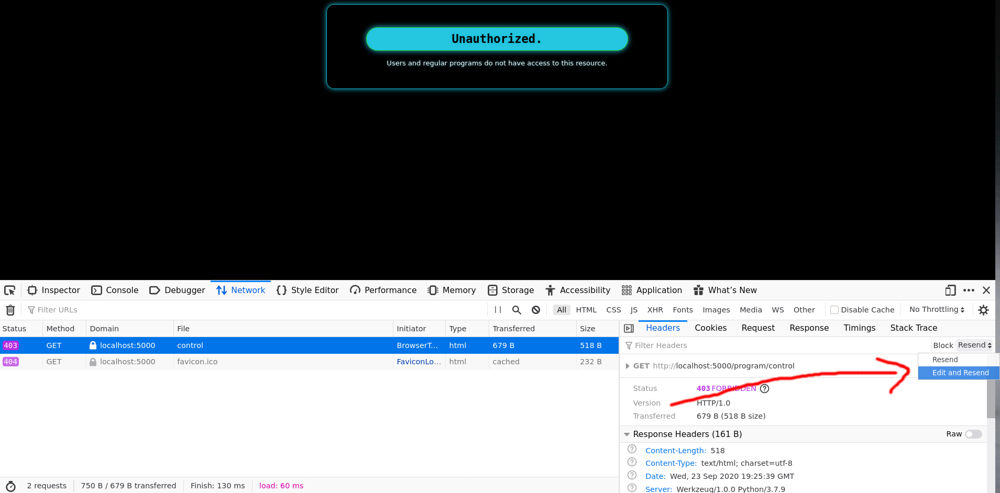

# Tron Header

## Step 1 html comment
- Should be very familiar with html comments being clues, this one leads you to `/program`
- If you try to go there, you receive an unauthorized page...
- One of the things you should notice on the index is that it welcomes your browser's user agent.
- This should be a hint to look at the robots.txt file for possible user agents to try.

## Step 2 User agents
- Looking at robots.txt:
```
User-agent: *
Disallow: /

User-agent: Program
Allow: /program/

User-agent: Master Control Program 0000
Allow: /program/control
```

- We see that the user agent `Program` is allowed at /program
- We also see that the user agent `Master Control Program 0000` is allowed at a new route `/program/control`

## Step 3 using user agent
- This can be done in the browser tools or with a separate program that handles requests, like postman or curl.
- To do it in the browser open up the network tab and make a request to `/program/control`
- This will give you an unauthorized error, but we can edit the next request by clicking on the request then on the "Headers" tab click resend, then edit and resend
- 

- We can then chance the `User-Agent` to be `Master Control Program 0000` and then send the request.

## Flag
- Flag is found at `/program/control` after setting the user agent to be `Master Control Program 0000`
- flag{who_programmed_you?}
